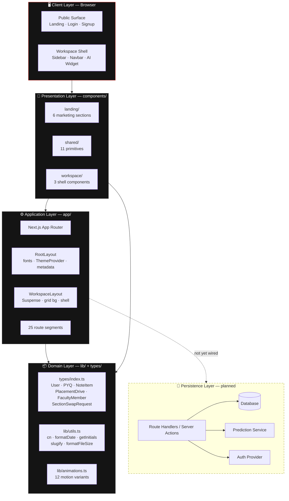
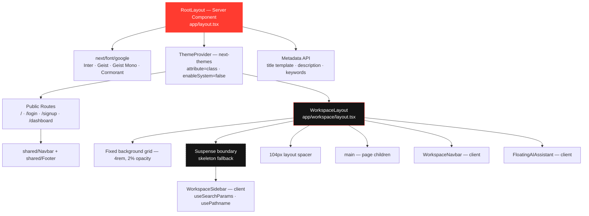
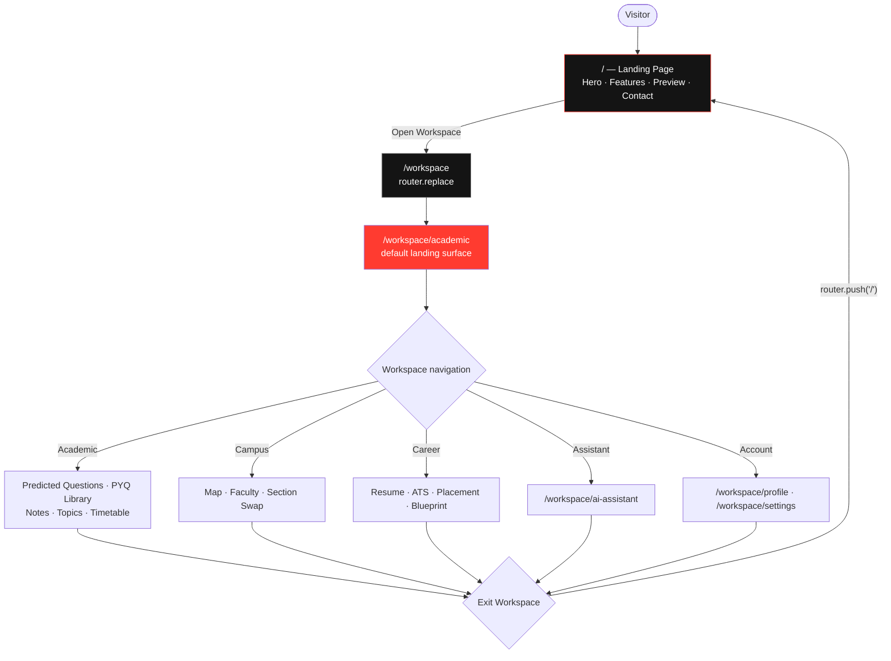
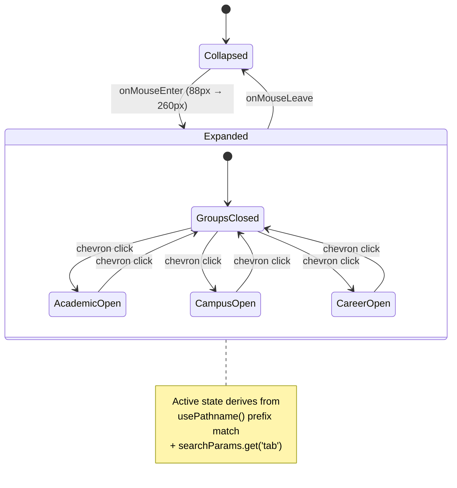
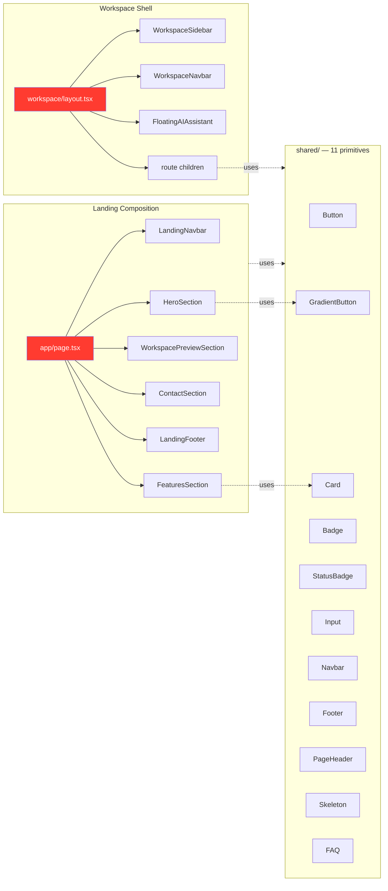
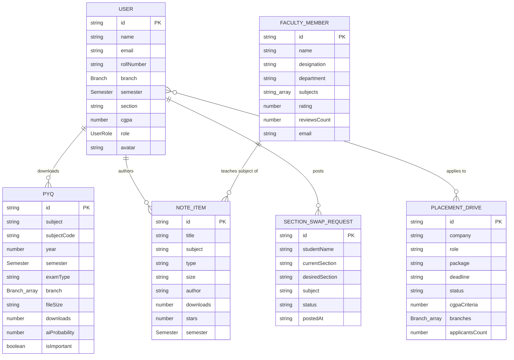

<div align="center">


<br />


<br />

[](https://nextjs.org)
[](https://react.dev)
[](https://www.typescriptlang.org)
[](https://tailwindcss.com)
[](https://motion.dev)
[](https://react.dev/learn/react-compiler)

*A dark-themed, glassmorphic SaaS platform that unifies academics, campus navigation, career services and AI-assisted exam preparation into a single workspace built for KIIT University students.*

</div>

---

## Table of Contents

- [Overview](#overview)
- [Project Status](#project-status)
- [Feature Matrix](#feature-matrix)
- [Tech Stack](#tech-stack)
- [System Architecture](#system-architecture)
- [Rendering Architecture](#rendering-architecture)
- [Application Flow](#application-flow)
- [Route Map](#route-map)
- [Project Structure](#project-structure)
- [Component Architecture](#component-architecture)
- [Data Models](#data-models)
- [Design System](#design-system)
- [Animation System](#animation-system)
- [Getting Started](#getting-started)
- [Available Scripts](#available-scripts)
- [Development Conventions](#development-conventions)
- [Known Gaps & Roadmap](#known-gaps--roadmap)
- [Contributing](#contributing)
- [License](#license)

---

## Overview

**KIITAnumaan** (KIIT + *अनुमान*, Hindi for "prediction") is a full-surface academic operating system for KIIT University. It brings four traditionally scattered student workflows under one authenticated workspace shell:

| Pillar | What it solves |
|--------|----------------|
| **Academic Intelligence** | Exam question prediction, PYQ archive, community notes, high-yield topics, timetable |
| **Campus Services** | Interactive campus map, faculty directory, section-swap marketplace |
| **Career & Placement** | Resume builder, ATS scoring, placement drive tracker, AI career blueprint |
| **AI Assistant** | Conversational academic help, available from every workspace page |

The product is delivered as a single Next.js App Router application: a public marketing surface, an authentication funnel, and a persistent workspace shell with a hover-expanding sidebar.

---

## Project Status

> **This repository currently contains the complete front-end (presentation) layer.**

Being explicit about this matters for anyone picking the project up:

| Layer | Status | Notes |
|-------|--------|-------|
| UI / UX surface | ✅ Implemented | 25 routes, 20 shared components, full design system |
| Type contracts | ✅ Implemented | `types/index.ts` defines the domain model |
| Interaction & animation | ✅ Implemented | Framer Motion variants, GSAP, Recharts dashboards |
| Data layer | ⚠️ Mocked | Fixture arrays are colocated inside page components |
| API routes | ❌ Not present | No `app/api/**`, no server actions |
| Authentication | 🚫 Removed for now | The auth layer is deliberately bypassed — every entry point opens `/workspace` directly. See [Authentication](#authentication) |
| AI inference | ❌ Simulated | Prediction/ATS flows drive local state and timers, not a model |
| Persistence | ❌ Not present | No database, ORM, or storage integration |
| Tests | ❌ Not present | No test runner configured |

Everything below describes the architecture **as it exists today**, with planned backend integration points marked separately in [Known Gaps & Roadmap](#known-gaps--roadmap).

---

## Feature Matrix

### Academic Intelligence

| Module | Route | Capability |
|--------|-------|-----------|
| **Academic Hub** | `/workspace/academic` | Recharts prediction-volume dashboard, paper import modals, module launcher |
| **Predicted Questions** | `/workspace/academic/predicted-questions` | Drag-and-drop paper upload, branch/subject/unit/difficulty filtering, generated question set with copy-to-clipboard |
| **PYQ Library** | `/workspace/academic/pyq-library` | Searchable past-paper archive filtered by year, semester, branch, exam type |
| **Notes Library** | `/workspace/academic/notes-library` | Community notes with author, rating, download counts |
| **Important Topics** | `/workspace/academic/important-topics` | High-yield topic mapping, with a nested `lecture-videos` view |
| **Class Timetable** | `/workspace/academic/class-timetable` | Section-aware weekly schedule grid |

### Campus Services

| Module | Route | Capability |
|--------|-------|-----------|
| **Campus Map** | `/workspace/campus` | Coordinate-pinned interactive map with zoom controls, building metadata (floors, capacity, area, hours, address) across 8 category tabs |
| **Faculty Directory** | `/workspace/faculty` | Faculty profiles with department, subjects, ratings, reviews |
| **Section Swap** | `/workspace/faculty` (swap tab) | Peer-to-peer section exchange board |

### Career & Placement

| Module | Route | Capability |
|--------|-------|-----------|
| **Resume Builder** | `/workspace/career` | Manual and AI-assisted modes with live preview |
| **ATS Checker** | `/workspace/career` (ats tab) | Compatibility scoring and keyword guidance |
| **Placement Planner** | `/workspace/career` (placement tab) | Company drives with tier, CTC, eligibility, interview stages, deadlines |
| **AI Blueprint / Mentor** | `/workspace/career` (blueprint, mentor tabs) | Goal-driven learning path generation |

### Assistant & Account

| Module | Route | Capability |
|--------|-------|-----------|
| **AI Assistant** | `/workspace/ai-assistant` | Full-page chat with quick-prompt templates |
| **Floating Assistant** | *(global)* | `FloatingAIAssistant` mounted in the workspace layout, reachable from any workspace route |
| **Profile** | `/workspace/profile` | Student identity, branch, semester, CGPA |
| **Settings** | `/workspace/settings` | Preference surface |

---

## Tech Stack

### Core Framework

| Technology | Version | Role |
|------------|---------|------|
| **Next.js** | 16.2.12 | App Router, file-system routing, font optimization, build pipeline |
| **React** | 19.2.4 | UI runtime |
| **React Compiler** | 1.0.0 | Automatic memoization — enabled via `reactCompiler: true` in [next.config.ts](next.config.ts) |
| **TypeScript** | 5.9.3 | `strict: true`, `@/*` path alias mapped to the project root |

### Styling & Design

| Technology | Version | Role |
|------------|---------|------|
| **Tailwind CSS** | 4.3.3 | CSS-first configuration via `@import "tailwindcss"` — no `tailwind.config.js` |
| **@tailwindcss/postcss** | 4.3.3 | The only PostCSS plugin ([postcss.config.mjs](postcss.config.mjs)) |
| **next-themes** | 0.4.6 | Class-strategy theme provider (`attribute="class"`, system detection disabled) |
| **tailwind-merge** + **clsx** | 3.6.0 / 2.1.1 | Conflict-safe class composition through the `cn()` helper |
| **class-variance-authority** | 0.7.1 | Typed component variants |

### UI Primitives — Radix

`react-avatar` · `react-dialog` · `react-dropdown-menu` · `react-progress` · `react-select` · `react-separator` · `react-slot` · `react-switch` · `react-tabs` · `react-tooltip`

Accessible, unstyled behaviour primitives; all visual styling is applied locally with Tailwind.

### Motion, Data & Forms

| Technology | Version | Role |
|------------|---------|------|
| **Framer Motion** | 12.43.0 | Declarative variants, layout and presence animation |
| **GSAP** | 3.15.0 | Timeline-based landing-page sequences |
| **Recharts** | 3.10.1 | Analytics charts (area charts, custom tooltips) |
| **lucide-react** | 1.28.0 | Icon system |
| **react-hook-form** | 7.83.0 | Uncontrolled form state |
| **@hookform/resolvers** | 5.5.7 | Validation bridge |
| **Zod** | 3.25.76 | Schema definition and inference |

### Typography

Four Google fonts loaded through `next/font/google` and exposed as CSS variables in [app/layout.tsx](app/layout.tsx):

| Font | Variable | Usage |
|------|----------|-------|
| **Inter** | `--font-inter` | Body / UI default |
| **Geist** | `--font-geist-sans` | Display and headings |
| **Geist Mono** | `--font-geist-mono` | Codes, metrics, tabular data |
| **Cormorant Garamond** | `--font-cormorant` | Editorial accents (`.font-serif-editorial`) |

---

## System Architecture

The application is organised in four layers. Everything above the dashed line exists today; the persistence layer is the planned integration boundary.



### Layer Responsibilities

| Layer | Directory | Owns | Must not |
|-------|-----------|------|----------|
| **Application** | `app/` | Routing, layouts, metadata, page composition, data fixtures | Contain reusable visual primitives |
| **Presentation** | `components/` | Rendering, interaction, accessibility | Fetch data or know about routes it doesn't receive |
| **Domain** | `types/`, `lib/` | Contracts and pure helpers | Import React components |
| **Assets** | `public/` | Static maps, logos, SVGs | — |

---

## Rendering Architecture

Two nested layouts define every screen. `RootLayout` is a **Server Component**; `WorkspaceLayout` composes client children behind a `Suspense` boundary because `WorkspaceSidebar` reads `useSearchParams()`.



**Current component split:** all 42 `.tsx` files under `app/` and `components/` are marked `'use client'` except `app/layout.tsx` and `app/workspace/layout.tsx`. This is a deliberate consequence of the fixture-driven, interaction-heavy UI; converting read-only surfaces to Server Components is the first step once real data sources land.

---

## Application Flow

### User Journey — entry to workspace



`/workspace` is a **redirect shim**: it renders a spinner and calls `router.replace()` inside `useEffect`, so `/workspace` always resolves to `/workspace/academic`.

### Authentication

**The login layer is currently removed.** There is no sign-in step between the landing page and the product — every CTA (`LandingNavbar`, `Navbar`, `HeroSection`, both footers, and the public section pages) links straight to `/workspace` or a deep workspace route.

The auth *pages* still exist on disk at [app/login/page.tsx](app/login/page.tsx), [app/signup/page.tsx](app/signup/page.tsx) and [app/onboarding/page.tsx](app/onboarding/page.tsx). Nothing links to them, but they remain directly reachable by URL, so restoring the funnel is a matter of repointing the CTAs back — no page rebuild required.

The workspace sidebar's exit control (`Exit Workspace`) simply returns to `/`; it clears no session, because there is none.

### AI Prediction Flow

The sequence implemented in `/workspace/academic/predicted-questions`. The dashed segment is where a real inference service will attach.

```mermaid
sequenceDiagram
    autonumber
    actor S as Student
    participant P as PredictedQuestions Page
    participant M as Upload Modal
    participant St as Local Component State
    participant API as "Prediction Service — planned"

    S->>P: Open Predicted Questions
    P->>S: Render filters (branch, subject, unit, difficulty)
    S->>P: Click "Import Papers"
    P->>M: isUploadModalOpen = true
    S->>M: Drag & drop PDF (isDragging)
    S->>M: Set branch, year, semester, session, exam type
    M->>St: Append to papers[]
    S->>P: Click "Generate Predictions"
    P->>St: isGenerating = true
    rect rgb(40,20,20)
    St-->>API: POST papers + metadata
    API-->>St: Ranked questions + probability
    end
    St->>P: hasGenerated = true, isGenerating = false
    P->>S: Render question set with probability badges
    S->>P: Copy question (copiedId)
```



### Navigation State Model

The sidebar is a controlled accordion driven entirely by URL state:



Group headers navigate to the section root on click; the chevron is a separate button that calls `stopPropagation()` to toggle the submenu without navigating.

---

## Route Map

### Public Routes

| Route | File | Type | Purpose |
|-------|------|------|---------|
| `/` | [app/page.tsx](app/page.tsx) | Client | Landing page — hero, features, workspace preview, contact |
| `/login` | [app/login/page.tsx](app/login/page.tsx) | Client | 💤 **Dormant** — sign-in form, no longer linked from anywhere |
| `/signup` | [app/signup/page.tsx](app/signup/page.tsx) | Client | 💤 **Dormant** — registration form, no longer linked from anywhere |
| `/onboarding` | [app/onboarding/page.tsx](app/onboarding/page.tsx) | Client | 💤 **Dormant** — redirect shim → `/workspace` |
| `/dashboard` | [app/dashboard/page.tsx](app/dashboard/page.tsx) | Client | Standalone overview with AI module entry point |
| `/academic` | [app/academic/page.tsx](app/academic/page.tsx) | Client | Public PYQ preview (gated CTAs → `/login`) |
| `/campus` | [app/campus/page.tsx](app/campus/page.tsx) | Client | Public campus overview |
| `/career` | [app/career/page.tsx](app/career/page.tsx) | Client | Public career overview |

### Workspace Routes

All routes below render inside [app/workspace/layout.tsx](app/workspace/layout.tsx).

| Route | File | Purpose |
|-------|------|---------|
| `/workspace` | [app/workspace/page.tsx](app/workspace/page.tsx) | Redirect shim → `/workspace/academic` |
| `/workspace/academic` | [app/workspace/academic/page.tsx](app/workspace/academic/page.tsx) | Academic hub — Recharts dashboard, import modals, `?tab=` handler |
| `/workspace/academic/predicted-questions` | [page.tsx](app/workspace/academic/predicted-questions/page.tsx) | AI question prediction |
| `/workspace/academic/pyq-library` | [page.tsx](app/workspace/academic/pyq-library/page.tsx) | Past-paper archive |
| `/workspace/academic/notes-library` | [page.tsx](app/workspace/academic/notes-library/page.tsx) | Community notes |
| `/workspace/academic/important-topics` | [page.tsx](app/workspace/academic/important-topics/page.tsx) | High-yield topics |
| `/workspace/academic/important-topics/lecture-videos` | [page.tsx](app/workspace/academic/important-topics/lecture-videos/page.tsx) | Topic-linked lecture videos |
| `/workspace/academic/class-timetable` | [page.tsx](app/workspace/academic/class-timetable/page.tsx) | Weekly schedule |
| `/workspace/campus` | [page.tsx](app/workspace/campus/page.tsx) | Campus map, 8 category tabs |
| `/workspace/career` | [page.tsx](app/workspace/career/page.tsx) | Career suite, 5 tabs |
| `/workspace/faculty` | [page.tsx](app/workspace/faculty/page.tsx) | Faculty directory + section swap |
| `/workspace/ai-assistant` | [page.tsx](app/workspace/ai-assistant/page.tsx) | Full-page AI chat |
| `/workspace/profile` | [page.tsx](app/workspace/profile/page.tsx) | Student profile |
| `/workspace/settings` | [page.tsx](app/workspace/settings/page.tsx) | Preferences |

### Query-Parameter Sub-navigation

| Section | Parameter values emitted by the sidebar |
|---------|------------------------------------------|
| Campus | `?tab=navigation` · `?tab=faculty` · `?tab=section-swap` |
| Career | `?tab=resume-builder` · `?tab=ats-checker` · `?tab=placement-planner` · `?tab=ai-blueprint` |
| Academic | `?tab=predictor` · `?tab=pyq` · `?tab=notes` · `?tab=resources` · `?tab=timetable` |

> **Note:** only the Academic hub currently consumes `?tab` (through its `TabParamsHandler`). See [Known Gaps](#known-gaps--roadmap).

---

## Project Structure

```
KIITAnumaan/
│
├── app/                                   # Next.js App Router — routing & pages
│   ├── layout.tsx                         # ⚡ Root layout (Server) — fonts, theme, metadata
│   ├── page.tsx                           # Landing page
│   ├── globals.css                        # Design tokens + Tailwind v4 entry
│   ├── favicon.ico
│   │
│   ├── login/page.tsx                     # Auth funnel
│   ├── signup/page.tsx
│   ├── onboarding/page.tsx                # → redirect shim
│   ├── dashboard/page.tsx
│   │
│   ├── academic/page.tsx                  # Public marketing surfaces
│   ├── campus/page.tsx
│   ├── career/page.tsx
│   │
│   └── workspace/                         # 🔒 Authenticated workspace
│       ├── layout.tsx                     # ⚡ Workspace shell (Server)
│       ├── page.tsx                       # → redirect shim
│       ├── academic/
│       │   ├── page.tsx                   # Hub + Recharts dashboard
│       │   ├── predicted-questions/page.tsx
│       │   ├── pyq-library/page.tsx
│       │   ├── notes-library/page.tsx
│       │   ├── class-timetable/page.tsx
│       │   └── important-topics/
│       │       ├── page.tsx
│       │       └── lecture-videos/page.tsx
│       ├── campus/page.tsx
│       ├── career/page.tsx
│       ├── faculty/page.tsx
│       ├── ai-assistant/page.tsx
│       ├── profile/page.tsx
│       └── settings/page.tsx
│
├── components/                            # Presentation layer (20 components)
│   ├── landing/                           # Marketing sections
│   │   ├── HeroSection.tsx
│   │   ├── FeaturesSection.tsx
│   │   ├── WorkspacePreviewSection.tsx
│   │   ├── ContactSection.tsx
│   │   ├── LandingNavbar.tsx
│   │   └── LandingFooter.tsx
│   ├── shared/                            # Reusable primitives
│   │   ├── Button.tsx      Card.tsx       Badge.tsx
│   │   ├── Input.tsx       Navbar.tsx     Footer.tsx
│   │   ├── FAQ.tsx         Skeleton.tsx   PageHeader.tsx
│   │   ├── StatusBadge.tsx GradientButton.tsx
│   └── workspace/                         # Workspace shell
│       ├── WorkspaceSidebar.tsx           # Hover-expand accordion nav
│       ├── WorkspaceNavbar.tsx            # Top bar
│       └── FloatingAIAssistant.tsx        # Global FAB
│
├── lib/                                   # Domain helpers
│   ├── utils.ts                           # cn, formatDate, formatRelativeTime,
│   │                                      # getInitials, generateColor, truncate,
│   │                                      # formatFileSize, slugify
│   └── animations.ts                      # 12 Framer Motion variants
│
├── types/
│   └── index.ts                           # Domain contracts
│
├── public/                                # Static assets
│   ├── kiit-map.jpg                       # Campus map base image
│   ├── kiit-campus-dotted.{jpg,png}
│   └── *.svg
│
├── next.config.ts                         # reactCompiler: true
├── postcss.config.mjs                     # @tailwindcss/postcss
├── tsconfig.json                          # strict, @/* → ./*
└── package.json
```

---

## Component Architecture



### Shared Primitives

| Component | Responsibility |
|-----------|---------------|
| `Button` | Variant-driven action button (`variant`, `size`, optional `href`) |
| `GradientButton` | High-emphasis CTA with gradient treatment |
| `Card` | Surface container — `#141414`, 1px `rgba(255,255,255,.08)` border |
| `Badge` / `StatusBadge` | Semantic status pills (`primary`, `success`, …) |
| `Input` | Themed text field |
| `Navbar` / `Footer` | Public-surface chrome |
| `PageHeader` | Title + description + eyebrow badge |
| `Skeleton` | Loading placeholder |
| `FAQ` | Accordion Q&A block |

### Workspace Shell

**`WorkspaceSidebar`** is the most structurally significant component. It:

- Expands `88px → 260px` on hover via a `cubic-bezier(0.22, 0.61, 0.36, 1)` width transition
- Renders three accordion groups (Academic, Campus, Career) with tree-connector guide lines
- Derives active state from `usePathname()` prefix matching plus `searchParams.get('tab')`
- Separates group **navigation** (whole row) from group **expansion** (chevron button with `stopPropagation`)
- Marks the active row with a 2px `#FF453A` left rail and staggers submenu items by `index * 30ms`

Because it calls `useSearchParams()`, it is wrapped in `<Suspense>` in the layout with a shape-matched skeleton fallback.

---

## Data Models

Defined in [types/index.ts](types/index.ts):



### Enumerations

```ts
type UserRole = 'student' | 'faculty' | 'admin' | 'placement_officer'
type Semester = 1 | 2 | 3 | 4 | 5 | 6 | 7 | 8
type Branch   = 'CSE' | 'ECE' | 'EEE' | 'ME' | 'CE' | 'IT' | 'CSE-AI' | 'CSE-DS'
```

> Relationships above are the **intended** domain graph. Today each page holds its own fixture array; these types are the contract a future data layer should satisfy.

---

## Design System

Tokens live in the `:root` block of [app/globals.css](app/globals.css).

### Colour Tokens

| Token | Value | Usage |
|-------|-------|-------|
| `--bg-main` | `#080808` | Application background |
| `--bg-surface` | `#101010` | Raised surfaces, table headers |
| `--bg-card` | `#141414` | Card fill |
| `--border` | `rgba(255,255,255,0.08)` | Default hairline border |
| `--border-hover` | `rgba(255,59,48,0.5)` | Interactive border |
| `--primary-accent` | `#FF3B30` | Brand accent, active states, CTAs |
| `--primary-accent-hover` | `#E03126` | Accent pressed/hover |
| `--text-main` | `#FFFFFF` | Primary text |
| `--text-muted` | `#9CA3AF` | Secondary text |
| `--text-dim` | `#6B7280` | Tertiary / metadata |

The workspace shell uses a slightly deeper palette applied inline: `#0B0B0D` (sidebar cards), `#141418` (active rows), `#FF453A` (workspace accent).

### Utility Classes

| Class | Effect |
|-------|--------|
| `.saas-card` | `#141414` surface, 12px radius, `-3px` lift + red border on hover |
| `.bg-subtle-grid` | 60px dual-axis grid at 3% opacity |
| `.noise-bg` | Fixed fractal-noise SVG overlay at 2% opacity, `z-50` |
| `.text-outlined-kiit` | Transparent fill, 2px `#FF3B30` stroke, rotated 90°, drop-shadow glow |
| `.hover-red-underline` | Width-animated 2px accent underline |
| `.font-serif-editorial` | Cormorant Garamond editorial type |

Scrollbars are restyled globally to 6px with a `#222222` thumb that turns `#FF3B30` on hover.

### Layout Constants

| Constant | Value |
|----------|-------|
| Sidebar collapsed / expanded | `88px` / `260px` |
| Sidebar layout spacer | `104px` |
| Sidebar inset | `12px` all sides, `calc(100vh - 24px)` tall |
| Card radius (shell) | `24px` |
| Nav row radius / height | `16px` / `48px` |
| Submenu row radius / height | `10px` / `40px` |
| Background grid | `4rem` at 2% opacity |
| Content max width | `1440px` |

---

## Animation System

[lib/animations.ts](lib/animations.ts) exports twelve reusable Framer Motion variants. The house easing curve is `[0.16, 1, 0.3, 1]` (expo-out).

| Variant | Motion | Duration |
|---------|--------|----------|
| `fadeIn` | Opacity only | 0.30s |
| `fadeInUp` / `fadeInDown` | ±16px on Y | 0.35s |
| `slideInLeft` / `slideInRight` | ±20px on X | 0.35s |
| `scaleIn` | 0.95 → 1 | 0.25s |
| `staggerContainer` | 0.08s per child, 0.05s initial delay | — |
| `staggerItem` | 12px rise | 0.30s |
| `pageTransition` | 8px enter / −8px exit | 0.40s / 0.20s |
| `sidebarVariants` | Width 256 ↔ 72 | 0.30s |
| `cardHoverVariants` | `scale 1.01`, `y −2` | 0.20s |
| `progressVariants` | Custom width `0% → n%` | 0.80s, 0.20s delay |

**Usage:**

```tsx
import { motion } from 'framer-motion'
import { staggerContainer, staggerItem } from '@/lib/animations'

<motion.ul variants={staggerContainer} initial="hidden" animate="visible">
  {items.map((item) => (
    <motion.li key={item.id} variants={staggerItem}>{item.title}</motion.li>
  ))}
</motion.ul>
```

GSAP handles landing-page timeline choreography where sequencing beyond variant orchestration is required.

---

## Getting Started

### Prerequisites

| Requirement | Version |
|-------------|---------|
| **Node.js** | 20.9 or newer (verified on 22.19.0) |
| **npm** | 10 or newer (verified on 11.13.0) |

### Installation

```bash
git clone <repository-url>
cd KIITAnumaan

# Reproducible install from the committed lockfile
npm ci
```

Use `npm ci` rather than `npm install` — it installs the exact tree in `package-lock.json` (149 packages) and fails loudly on drift.

### Run the development server

```bash
npm run dev
```

Open [http://localhost:3000](http://localhost:3000). The landing page is at `/`; go straight to the product at `/workspace`.

### Production build

```bash
npm run build
npm run start
```

### Environment variables

None are required today — there are no external services wired up. When the persistence layer lands, add a `.env.example` and document each key here.

---

## Available Scripts

| Script | Command | Description |
|--------|---------|-------------|
| `dev` | `next dev` | Development server with HMR |
| `build` | `next build` | Optimised production build |
| `start` | `next start` | Serve the production build |

> No `lint` or `test` script is defined yet. Adding ESLint (`next lint`) and a test runner is tracked in the roadmap below.

---

## Development Conventions

### Imports

Always use the `@/` alias — it maps to the project root:

```ts
import Button from '@/components/shared/Button'
import { cn } from '@/lib/utils'
import type { PYQ, Branch } from '@/types'
```

### Class composition

Compose Tailwind classes through `cn()` so conflicting utilities resolve predictably:

```tsx
import { cn } from '@/lib/utils'

<div className={cn('rounded-xl border px-4 py-2', isActive && 'border-[#FF3B30] text-white')} />
```

### Component rules

1. **Server by default.** Add `'use client'` only when a component needs state, effects, or browser APIs.
2. **Suspend `useSearchParams()`.** Any client component reading search params must sit behind a `<Suspense>` boundary with a shape-matched fallback, as `WorkspaceSidebar` does.
3. **Type the domain.** New entities belong in `types/index.ts`, not inline in a page.
4. **Reuse before adding.** Check `components/shared/` before creating another button or card.
5. **Animate from the library.** Import variants from `lib/animations.ts` instead of writing one-off transitions, so motion stays consistent.

### Styling

Tailwind v4 is configured **CSS-first** — there is no `tailwind.config.js`. Add design tokens to the `:root` block in `app/globals.css` and reference them, rather than hard-coding new hex values in components.

---

## Known Gaps & Roadmap

### Known gaps in the current code

| Gap | Location | Impact |
|-----|----------|--------|
| Campus and Career pages ignore `?tab` | [app/workspace/campus/page.tsx](app/workspace/campus/page.tsx), [app/workspace/career/page.tsx](app/workspace/career/page.tsx) | Sidebar submenu links navigate to the section root but never select the tab; tabs are local `useState` only |
| Career tab values disagree with sidebar links | Sidebar emits `resume-builder` / `ats-checker` / `placement-planner` / `ai-blueprint`; the page's `CareerTab` union is `resume` / `ats` / `placement` / `blueprint` / `mentor` | Deep links cannot match even once `?tab` is read |
| `--background` / `--text` are undefined | [app/layout.tsx](app/layout.tsx) `<body>` references them, but `globals.css` defines `--bg-main` / `--text-main` | Declarations are dropped; the correct colour only survives via the `body` rule |
| Faculty is reachable two ways | `/workspace/faculty` route and the Campus "Faculty Directory" tab | Duplicate surfaces can drift apart |
| Every page is a Client Component | All of `app/**/page.tsx` | Larger client bundle than necessary; no streaming benefit |
| 4 high-severity advisories | Transitive via `next@16.2.12` (`postcss`, `sharp`, `nanoid`) | Resolving requires a Next minor bump beyond the pinned range |

### Roadmap

- [ ] **Backend integration** — Route Handlers or Server Actions replacing colocated fixtures
- [ ] **Reinstate authentication** — the funnel is bypassed for now; bring it back as session-backed auth with route middleware protecting `/workspace/**`, then repoint the CTAs from `/workspace` to `/login`
- [ ] **Persistence** — database schema derived from `types/index.ts`
- [ ] **Prediction service** — replace the simulated generate step with real inference
- [ ] **File pipeline** — PDF upload, storage, and parsing for PYQs and notes
- [ ] **URL-driven tabs** — make Campus and Career read `?tab`, and reconcile the value vocabularies
- [ ] **Server Component migration** — move read-only surfaces off the client
- [ ] **Tooling** — ESLint, Prettier, a test runner, and CI
- [ ] **Accessibility audit** — keyboard traversal of the hover-expand sidebar, focus management in modals

---

## Contributing

```bash
git checkout -b feat/<short-description>
# implement, following the conventions above
npm run build          # must pass before opening a PR
git commit -m "feat: <what changed and why>"
git push origin feat/<short-description>
```

**Pull request checklist**

- [ ] `npm run build` completes without errors
- [ ] New domain entities are declared in `types/index.ts`
- [ ] Colours use design tokens, not new hard-coded hex values
- [ ] Animations use variants from `lib/animations.ts`
- [ ] `'use client'` is added only where genuinely required
- [ ] Any component calling `useSearchParams()` sits inside a `<Suspense>` boundary

Commits follow [Conventional Commits](https://www.conventionalcommits.org/): `feat:`, `fix:`, `refactor:`, `style:`, `docs:`, `chore:`.

---

## License

Released under the **MIT License**.

<div align="center">


</div>
